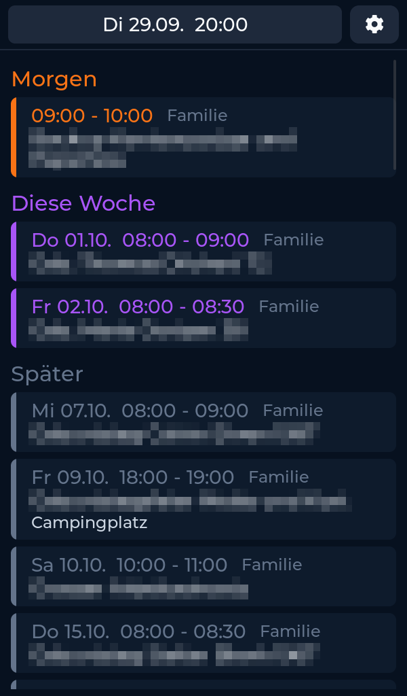
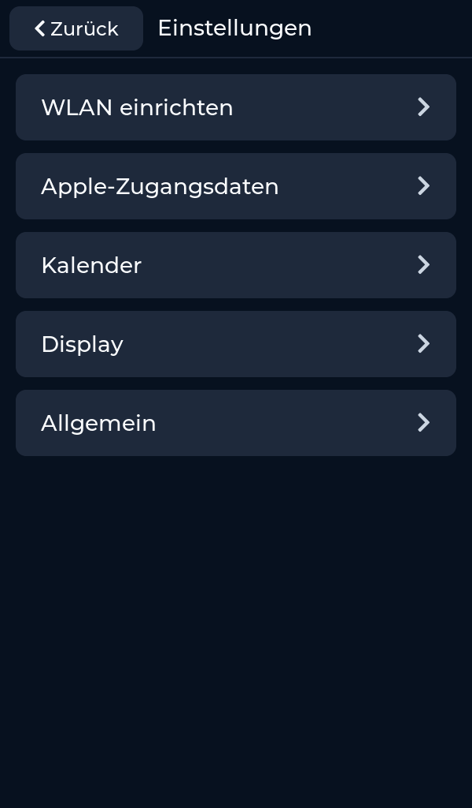
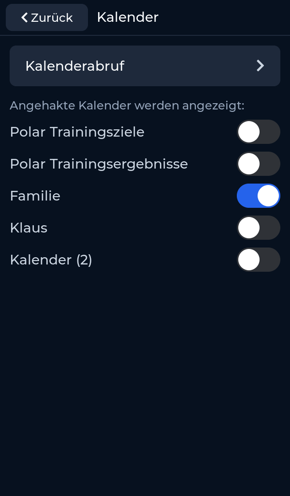
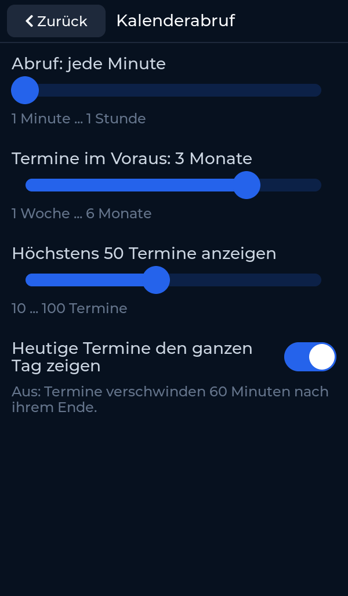
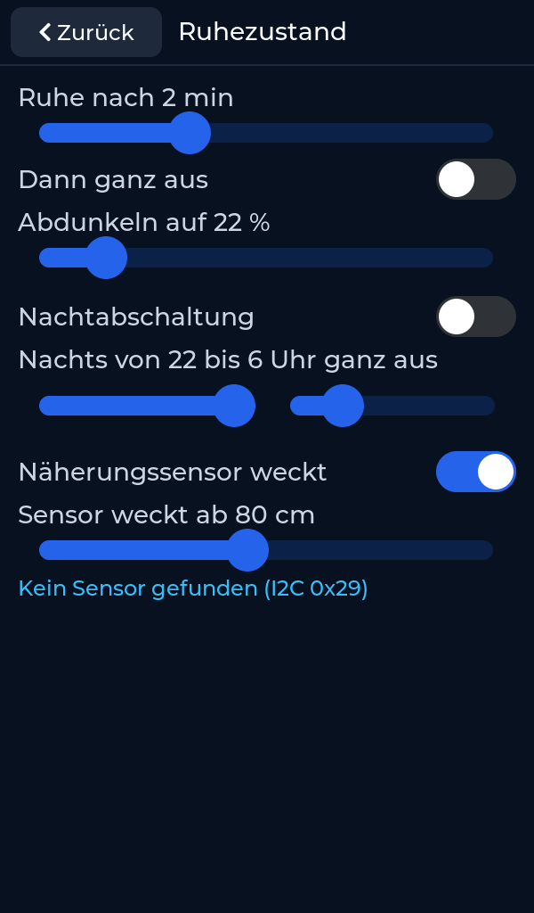
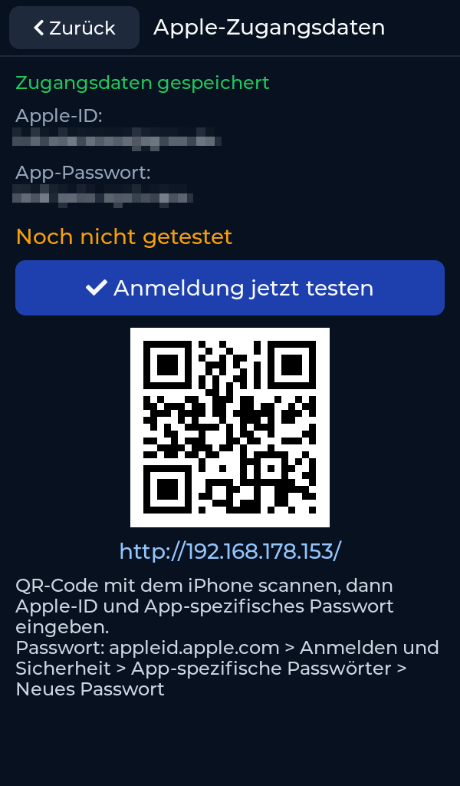
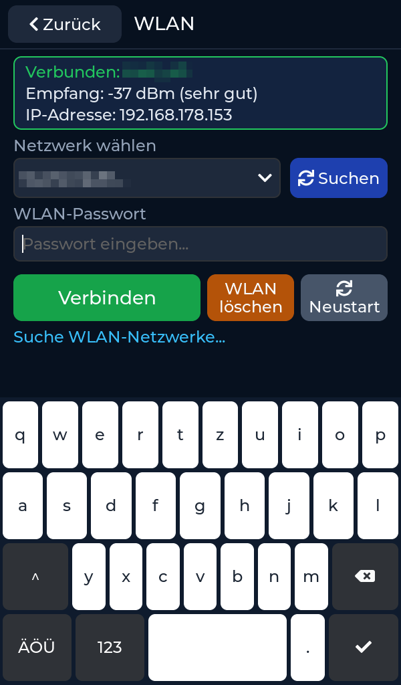

# Display Apple Kalender – deine Termine immer im Blick

**Der Familienkalender aus der Apple-iCloud auf einem 5-Zoll-Touchdisplay – hochkant, groß und gut lesbar.**

- 🗓️ **Termine aus dem Apple-Kalender (iCloud)** – gruppiert nach *Heute*, *Morgen*, *Diese Woche* und *Später*
- 👨‍👩‍👧 **Du wählst, welche Kalender angezeigt werden** – z. B. nur „Familie“; neue Kalender erscheinen automatisch
- 🔄 **Aktualisiert sich selbst** über WLAN – jede Minute bis jede Stunde, bis zu 6 Monate im Voraus
- 🔤 **Große Schrift** – Uhrzeit, Termin und darunter der Ort; aus welchem Kalender er stammt, steht klein daneben
- 🌙 **Ruhezustand und Nachtabschaltung** – abdunkeln oder ganz aus, auf Wunsch weckt ein Näherungssensor das Display
- 📱 **Einrichten per iPhone** – Apple-Zugangsdaten per QR-Code eintragen, ohne Tippen am Display

Zum Ausprobieren läuft es **72 Stunden kostenlos und ohne Einschränkung**.



*Termintitel sind in allen Bildern verpixelt.*

**Inhalt:** [Bedienung](#bedienung) · [Hardware](#hardware) · [Installation](#1-installation) ·
[Testzeit](#2-erster-start-testzeit) · [Freischalten](#3-freischalten) · [Updates](#4-updates)

## Bedienung

Die komplette **[Bedienungsanleitung (PDF)](docs/Bedienungsanleitung.pdf)** zeigt jede Seite und jede Einstellung.

| Einstellungen | Kalender auswählen |
|---|---|
|  |  |
| **Kalenderabruf** | **Ruhezustand & Sensor** |
|  |  |
| **Apple-Zugangsdaten** | **WLAN** |
|  |  |

*Apple-ID, App-Passwort und WLAN-Name sind im Bild verpixelt – das macht das Display beim Bildschirmfoto selbst.*

- **Terminliste:** wischen zum Blättern; nach 10 Sekunden ohne Bedienung springt sie zurück zum ersten Termin.
- **Zahnrad oben rechts:** öffnet die Einstellungen – alles wird sofort gespeichert.
- **Ruhezustand:** die erste Berührung weckt nur auf und löst nichts aus.

## Hardware

- **Display:** Waveshare **ESP32-S3-Touch-LCD-5B** (5 Zoll, 1024×600, WLAN), hochkant betrieben.
  Strom über USB-C.
- **Näherungssensor (optional):** VL53L0X oder VL53L1X am I2C-Anschluss des Displays –
  das Display wird hell, sobald jemand davorsteht.

Für den Apple-Kalender brauchst du deine **Apple-ID** und ein **App-spezifisches Passwort**
(*appleid.apple.com → Anmelden und Sicherheit → App-spezifische Passwörter*) – nicht dein normales Apple-Passwort.

## Einkaufsliste

| Teil | Wofür | Link |
|---|---|---|
| Waveshare ESP32-S3-Touch-LCD-5B (5 Zoll, 1024×600) | Das Display | [Amazon\*](https://www.amazon.de/dp/B0DD7N19FT?tag=wohnmobildisp-21) |
| VL53L0X-Näherungssensor (6 Stück) | Display wird hell, wenn jemand davorsteht (optional) | [Amazon\*](https://www.amazon.de/dp/B0D3PRSV3B?tag=wohnmobildisp-21) |

\* Werbelink: Als Amazon-Partner verdiene ich an qualifizierten Verkäufen. Für dich ändert sich am Preis nichts.

## 1. Installation

Die Firmware wird direkt im Browser installiert – ohne Download und ohne Zusatzprogramm.

**Du brauchst:**
- ein USB-Datenkabel (ein reines Ladekabel funktioniert nicht),
- einen Computer mit **Google Chrome** oder **Microsoft Edge**,
- kein anderes Programm, das gerade auf den USB-Anschluss zugreift (z. B. Arduino IDE, serieller Monitor).

**So geht's:**
1. Öffne die Installer-Seite: **[wohnmobil-display.github.io/Display-Apple-Kalender](https://wohnmobil-display.github.io/Display-Apple-Kalender/)**
2. Schließe das Display per USB-C an und klicke auf **Installieren**.
3. Wähle im Fenster den Eintrag deines Displays (z. B. „USB JTAG/serial debug unit“ oder „USB Single Serial“) und klicke auf **Verbinden**.
4. Bestätige die Installation und warte, bis sie fertig ist. Kabel nicht abziehen, Browser nicht schließen.
5. Das Display startet danach von selbst neu. Falls nicht: kurz vom Strom trennen und wieder anschließen.

> Wird kein Gerät angezeigt, probiere ein anderes Kabel oder einen anderen USB-Anschluss.
> Stecke das Display kurz ab und wieder an und wähle dann den neu erschienenen Eintrag.

Danach am Display das **WLAN** einrichten und die **Apple-Zugangsdaten** per QR-Code mit dem iPhone eintragen –
Schritt für Schritt in der [Bedienungsanleitung](docs/Bedienungsanleitung.pdf).

## 2. Erster Start: Testzeit

Beim ersten Start zeigt das Display den Bildschirm **Freischaltung** mit zwei Werten:

- **Chip-ID**, z. B. `AA:BB:CC:DD:EE:FF`
- **Freigabecode**, z. B. `1234`

Darunter steht die fertige Zeile zum Freischalten, z. B.:

```
AA:BB:CC:DD:EE:FF 1234
```

Mit **„Test starten (72 Std.)“** kannst du das Display 72 Betriebsstunden lang kostenlos und uneingeschränkt nutzen.
Gezählt wird nur die Zeit, in der das Display eingeschaltet ist. Die restliche Testzeit steht unter
*Einstellungen → Allgemein → Freischaltung*. Nach Ablauf zeigt das Display nur noch den Freischalt-Bildschirm.

## 3. Freischalten

Das Display Apple Kalender ist ein privat entwickeltes Hobbyprojekt. Für die dauerhafte Nutzung ist ein persönlicher,
6-stelliger **Freischaltcode** nötig. Er kostet einmalig **3 €** und gilt für immer – auch nach Neustarts und Updates.

1. Öffne den PayPal-Link: **[paypal.com/ncp/payment/H9SBA2295L8MY](https://www.paypal.com/ncp/payment/H9SBA2295L8MY)** –
   oder scanne einfach den **QR-Code auf dem Freischalt-Bildschirm** mit dem Handy.
2. Trage im Feld **„Chip-ID + Freigabecode“** die Zeile vom Display ein – genau so, wie sie dort steht:
   `AA:BB:CC:DD:EE:FF 1234`
3. Nach Eingang der Zahlung bekommst du den Freischaltcode per E-Mail, in der Regel **innerhalb von 24 Stunden**.
4. Gib den Code am Display ein und bestätige mit **OK**. Fertig – das Display ist dauerhaft freigeschaltet.

> Feld beim Bezahlen vergessen? Schick die Zeile einfach an **wohnmobil.display@gmail.com**.
>
> Nach jeder dritten falschen Eingabe wird die Eingabe für einige Stunden gesperrt – den Code bitte genau übernehmen.

## 4. Updates

Neue Versionen installierst du über die [Installer-Seite](https://wohnmobil-display.github.io/Display-Apple-Kalender/) –
**deine Einstellungen und die Freischaltung bleiben dabei erhalten**. Ein Update direkt am Display über WLAN folgt.

Was sich geändert hat, steht bei den [Versionen (Releases)](https://github.com/Wohnmobil-Display/Display-Apple-Kalender/releases).

## Hilfe bei Verbindungsproblemen

- Nur Chrome oder Edge verwenden.
- Ein anderes USB-Kabel und einen anderen USB-Anschluss probieren.
- Alle Programme schließen, die den USB-Anschluss benutzen könnten.
- Display kurz abziehen und wieder anschließen, Installer-Seite neu laden.

## Manuelle Installation

Falls die Installer-Seite nicht funktioniert: Im Ordner [`docs/firmware`](docs/firmware) liegt
`Display-Apple-Kalender-FULL.bin`. Sie wird mit einem eigenen Flash-Programm an **Adresse 0x0** geschrieben.
Achtung: Dabei werden alle Einstellungen gelöscht (WLAN, Apple-Zugangsdaten) – die Freischaltung musst du dann
mit deinem Code erneut eingeben.

## Hinweis

Das Display Apple Kalender ist ein privates DIY-Projekt ohne Firma dahinter und steht in keiner Verbindung zu Apple
oder Waveshare. „Apple“ und „iCloud“ sind Marken der Apple Inc. Die Nutzung erfolgt auf eigene Verantwortung.

Kontakt: **wohnmobil.display@gmail.com**
